# Software Design Document (SDD)
## CashFlow — Sistema de Controle de Fluxo de Caixa

| Campo | Valor |
|---|---|
| Versão | 1.2 |
| Data | 2026-05-14 |
| Status | Aprovado |
| Autor | André Roque |
| Tecnologia Principal | .NET 10, RabbitMQ, PostgreSQL, Redis, Keycloak |

---

## Índice

1. [Introdução](#1-introdução)
2. [Escopo e Contexto de Negócio](#2-escopo-e-contexto-de-negócio)
3. [Stakeholders](#3-stakeholders)
4. [Requisitos Funcionais Refinados](#4-requisitos-funcionais-refinados)
5. [Requisitos Não-Funcionais com Metas Mensuráveis](#5-requisitos-não-funcionais-com-metas-mensuráveis)
6. [Domínios Funcionais e Capacidades de Negócio](#6-domínios-funcionais-e-capacidades-de-negócio)
7. [Arquitetura da Solução](#7-arquitetura-da-solução)
8. [Modelo de Domínio](#8-modelo-de-domínio)
9. [Design de APIs](#9-design-de-apis)
10. [Estratégia de Integração e Comunicação](#10-estratégia-de-integração-e-comunicação)
11. [Modelo de Dados](#11-modelo-de-dados)
12. [Estratégia de Segurança](#12-estratégia-de-segurança)
13. [Estratégia de Resiliência](#13-estratégia-de-resiliência)
14. [Observabilidade e Monitoramento](#14-observabilidade-e-monitoramento)
15. [Arquitetura de Deploy](#15-arquitetura-de-deploy)
16. [Architecture Decision Records (ADRs)](#16-architecture-decision-records-adrs)
17. [Arquitetura de Transição](#17-arquitetura-de-transição)
18. [Estimativa de Custos](#18-estimativa-de-custos)
19. [Melhorias Futuras e Roadmap](#19-melhorias-futuras-e-roadmap)
20. [Glossário](#20-glossário)

---

## 1. Introdução

### 1.1 Propósito

Este documento descreve a solução técnica completa para o sistema **CashFlow**, um sistema de controle de fluxo de caixa diário para comerciantes. O documento serve como referência arquitetural para desenvolvimento, operação e evolução futura do sistema.

### 1.2 Objetivos do Sistema

- Permitir que comerciantes registrem lançamentos financeiros (débitos e créditos) em tempo real
- Disponibilizar relatório de saldo consolidado por dia
- Garantir que o registro de lançamentos nunca seja interrompido por falhas no módulo de consolidação
- Suportar picos de carga de 50 requisições/segundo no serviço de consolidação

### 1.3 Abreviações e Siglas

| Sigla | Significado |
|---|---|
| CQRS | Command Query Responsibility Segregation |
| EDA | Event-Driven Architecture |
| SDD | Software Design Document |
| ADR | Architecture Decision Record |
| NFR | Non-Functional Requirement |
| TTL | Time To Live |
| RPS | Requests Per Second |
| DLQ | Dead Letter Queue |
| DTO | Data Transfer Object |
| EF Core | Entity Framework Core |
| JWT | JSON Web Token |
| OIDC | OpenID Connect |
| IdP | Identity Provider |

---

## 2. Escopo e Contexto de Negócio

### 2.1 Problema de Negócio

Um comerciante opera um negócio com múltiplas transações financeiras diárias (vendas, pagamentos a fornecedores, despesas operacionais). Hoje, o controle é feito manualmente, gerando:

- Dificuldade de visibilidade do saldo em tempo real
- Risco de erros de lançamento
- Ausência de histórico estruturado
- Impossibilidade de análise de tendências

### 2.2 Solução Proposta

Sistema digital com dois serviços independentes:

1. **Serviço de Lançamentos**: Registro em tempo real de débitos e créditos
2. **Serviço de Consolidado Diário**: Relatório do saldo acumulado por dia

### 2.3 Fora do Escopo (v1.0)

- Multitenancy (múltiplos comerciantes)
- Conciliação bancária automática
- Integração com sistemas de pagamento (ex: PagSeguro, Cielo)
- Relatórios avançados (mensal, semanal, por categoria)
- Exportação de dados (CSV, PDF)

---

## 3. Stakeholders

| Perfil | Interesse | Impacto |
|---|---|---|
| Comerciante | Registrar lançamentos e consultar saldo | Alto — usuário final |
| Equipe de Operações | Monitorar saúde dos serviços | Médio — responsável pela disponibilidade |
| Equipe de Desenvolvimento | Manutenção e evolução | Alto — responsável técnico |
| Contador/Financeiro | Acurácia dos dados consolidados | Alto — dependente do relatório |

---

## 4. Requisitos Funcionais Refinados

### RF-01: Registro de Lançamento

| Campo | Descrição |
|---|---|
| **ID** | RF-01 |
| **Nome** | Registrar Lançamento Financeiro |
| **Descrição** | O sistema deve permitir o registro de lançamentos individuais do tipo débito ou crédito, com valor, data e descrição opcional |
| **Ator** | Comerciante / Sistema Integrador |
| **Pré-condição** | Valor deve ser positivo; tipo deve ser "debit" ou "credit" |
| **Pós-condição** | Lançamento persistido; evento publicado na fila |
| **Regras de negócio** | Valor > 0; timestamp em UTC; tipo case-insensitive |

**Fluxo Principal:**
1. Cliente envia `POST /api/v1/transactions` com payload
2. Sistema valida o payload (tipo, valor)
3. Cria entidade `Transaction` com ID gerado
4. Persiste no banco de dados
5. Publica `TransactionCreatedEvent` no RabbitMQ
6. Retorna `201 Created` com dados do lançamento

**Fluxo Alternativo — Payload inválido:**
- Se `amount <= 0` → retorna `400 Bad Request` com mensagem de erro
- Se `type` inválido → retorna `400 Bad Request` com valores aceitos

---

### RF-02: Consulta de Lançamentos

| Campo | Descrição |
|---|---|
| **ID** | RF-02 |
| **Nome** | Consultar Histórico de Lançamentos |
| **Descrição** | O sistema deve permitir listagem de lançamentos, com filtro opcional por data |
| **Ator** | Comerciante |
| **Parâmetros** | `?date=YYYY-MM-DD` (opcional) |
| **Ordenação** | Decrescente por `occurredAt` |

---

### RF-03: Relatório de Saldo Diário Consolidado

| Campo | Descrição |
|---|---|
| **ID** | RF-03 |
| **Nome** | Consultar Saldo Consolidado por Data |
| **Descrição** | O sistema deve retornar o saldo consolidado de um dia específico, incluindo total de créditos, débitos e saldo líquido |
| **Ator** | Comerciante / Contador |
| **Parâmetros** | `{date}` no formato `YYYY-MM-DD` (path parameter) |
| **Regras** | Saldo = TotalCredits - TotalDebits; se não há lançamentos no dia → 404 |

---

### RF-04: Atualização Automática do Consolidado

| Campo | Descrição |
|---|---|
| **ID** | RF-04 |
| **Nome** | Consolidar Lançamento Automaticamente |
| **Descrição** | A cada novo lançamento registrado, o consolidado do dia correspondente deve ser atualizado automaticamente de forma assíncrona |
| **Ator** | Sistema (consumer RabbitMQ) |
| **Garantia** | At-least-once delivery via MassTransit |

---

## 5. Requisitos Não-Funcionais com Metas Mensuráveis

| ID | Requisito | Meta | Como Medir | Como Atender |
|---|---|---|---|---|
| NFR-01 | **Disponibilidade do serviço de lançamentos** | 99,9% uptime (≤ 8,7h downtime/ano) | Monitoramento /health | Deploy independente; sem dependência síncrona do Consolidation |
| NFR-02 | **Throughput do Consolidation** | 50 RPS sustentados | Teste de carga (k6/JMeter) | Redis cache-aside (suporta >100k RPS) |
| NFR-03 | **Taxa de perda de requisições** | ≤ 5% em pico | % de 5xx / total requests | Redis elimina carga no PostgreSQL em pico |
| NFR-04 | **Latência do Consolidation (p95)** | ≤ 200ms (cache hit ≤ 10ms) | Percentil 95 de tempo de resposta | Redis cache; consulta pré-computada |
| NFR-05 | **Latência do Transactions (p95)** | ≤ 500ms | Percentil 95 | PostgreSQL com índice em `OccurredAt` |
| NFR-06 | **Consistência do consolidado** | Eventual; delay máx. de 5s | Diferença de timestamp entre evento e atualização | RabbitMQ com consumer dedicado |
| NFR-07 | **Durabilidade dos lançamentos** | Zero perda após persistência | Testes de falha de RabbitMQ | PostgreSQL persiste antes do publish; MassTransit com retry |
| NFR-08 | **Escalabilidade horizontal** | Suportar 2x carga sem alteração de código | Teste de carga com 2 instâncias | Stateless APIs; estado apenas nos datastores |

---

## 6. Domínios Funcionais e Capacidades de Negócio

### 6.1 Mapa de Capacidades

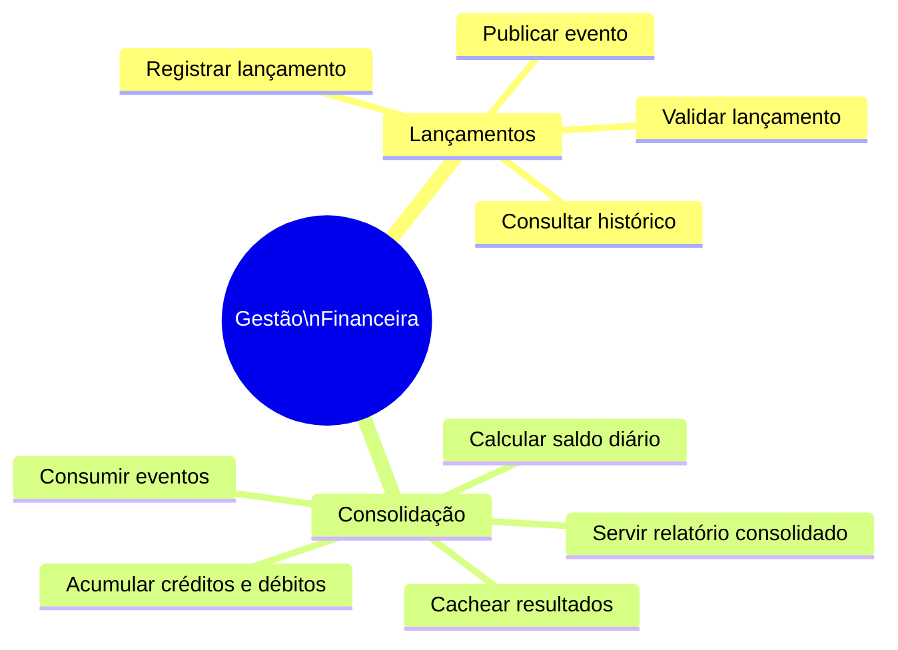

### 6.2 Classificação de Subdomínios (DDD)

| Subdomínio | Tipo | Justificativa |
|---|---|---|
| Lançamentos | **Core Domain** | Diferencial competitivo; regras de negócio críticas |
| Consolidação | **Core Domain** | Entrega valor direto ao usuário final |
| Infraestrutura de Mensageria | **Generic Subdomain** | Capacidade genérica (commodity) |
| Cache | **Generic Subdomain** | Capacidade genérica (commodity) |

### 6.3 Bounded Contexts e Linguagem Ubíqua

**Contexto: Lançamentos (Transactions)**

| Termo | Definição no Contexto |
|---|---|
| `Transaction` | Um registro financeiro único de débito ou crédito |
| `Amount` | Valor monetário positivo do lançamento |
| `Type` | Classificação: `debit` (saída) ou `credit` (entrada) |
| `OccurredAt` | Momento real do evento financeiro (UTC) |

**Contexto: Consolidação (Consolidation)**

| Termo | Definição no Contexto |
|---|---|
| `DailyConsolidation` | Agregado do saldo de um dia específico |
| `Balance` | Saldo líquido = TotalCredits - TotalDebits |
| `TotalCredits` | Soma de todas as entradas do dia |
| `TotalDebits` | Soma de todas as saídas do dia |
| `TransactionCount` | Número de lançamentos processados no dia |

---

## 7. Arquitetura da Solução

### 7.1 Visão Geral — Diagrama de Contexto (C4 Level 1)

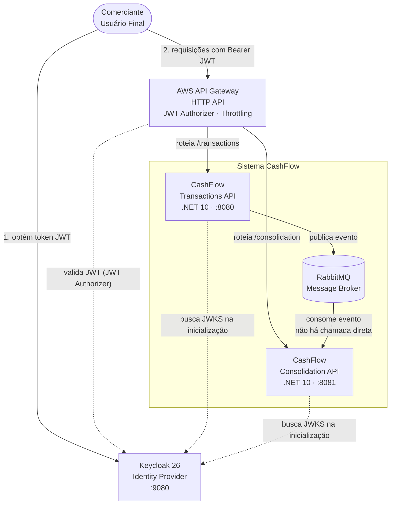

> **Dev vs Prod:** em desenvolvimento (Docker Compose) não há API Gateway — os serviços são acessados diretamente em `:8080` e `:8081`. O gateway existe apenas no ambiente AWS.

### 7.2 Diagrama de Containers (C4 Level 2)

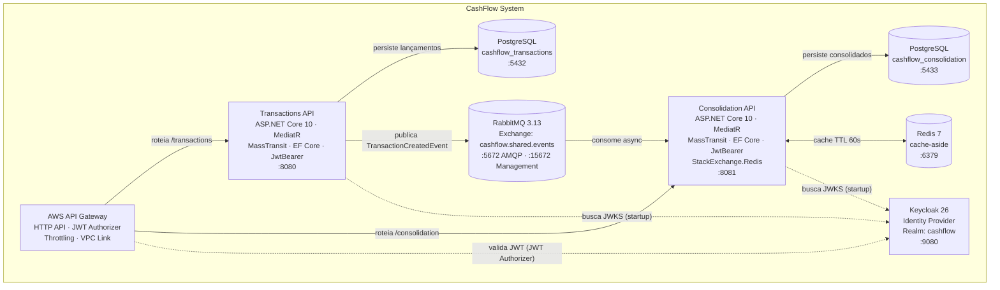

### 7.3 Diagrama de Componentes — Transactions (C4 Level 3)

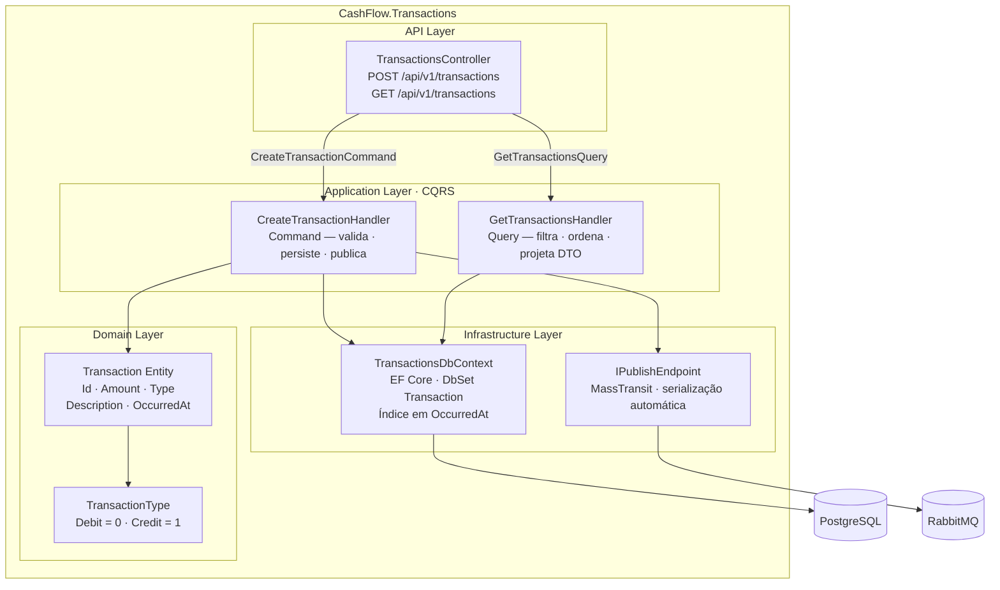

### 7.4 Diagrama de Componentes — Consolidation (C4 Level 3)

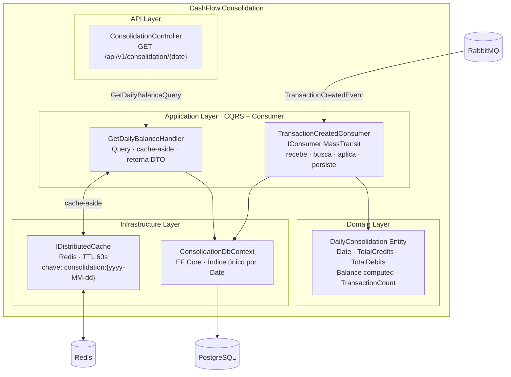

### 7.5 Padrão Arquitetural Adotado

**Event-Driven Microservices** com CQRS — foi escolhido sobre as alternativas:

| Alternativa | Prós | Contras | Decisão |
|---|---|---|---|
| Monolito | Simples de operar | Não atende NFR-01 (coupling total) | Descartado |
| Microsserviços síncronos (REST-to-REST) | Simples | Transactions cai se Consolidation cair | Descartado |
| **Microsserviços + EDA (escolhido)** | Desacoplamento total | Consistência eventual | **Adotado** |
| Serverless (Lambda/Functions) | Escala zero | Latência fria; vendor lock-in | Descartado para v1 |

---

## 8. Modelo de Domínio

### 8.1 Transaction (Contexto: Lançamentos)

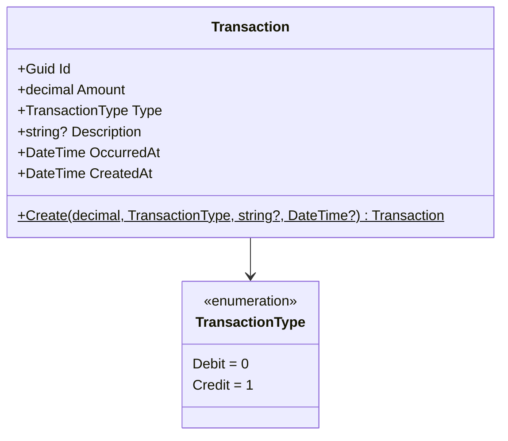

**Invariantes do domínio:**
- `Amount` deve ser estritamente positivo (`> 0`)
- `Type` deve ser `Debit` ou `Credit`
- `OccurredAt` é convertido para UTC antes de persistir

### 8.2 DailyConsolidation (Contexto: Consolidação)

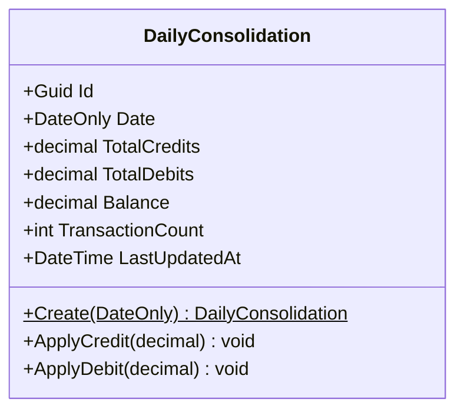

**Invariantes do domínio:**
- `Date` é único por registro (índice único no banco)
- `Balance` é derivado: sempre `TotalCredits - TotalDebits`
- Apenas `ApplyCredit`/`ApplyDebit` modificam o estado (encapsulamento)

### 8.3 Contrato de Evento Compartilhado

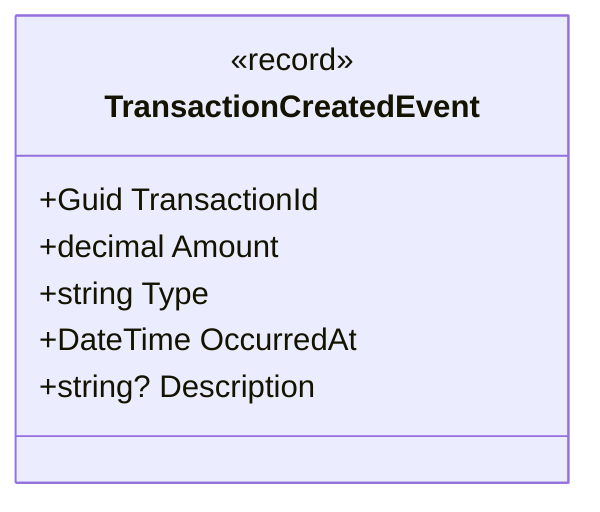

---

## 9. Design de APIs

### 9.1 Transactions API — Contratos

#### POST /api/v1/transactions

**Request Body:**
```json
{
  "amount": 1500.00,
  "type": "credit",
  "description": "Venda balcão - NF 1234",
  "occurredAt": "2026-05-14T10:30:00Z"
}
```

| Campo | Tipo | Obrigatório | Validação |
|---|---|---|---|
| `amount` | decimal | Sim | > 0 |
| `type` | string | Sim | "debit" ou "credit" (case-insensitive) |
| `description` | string | Não | — |
| `occurredAt` | datetime | Não | ISO 8601 UTC; default = now() |

**Response 201:**
```json
{
  "id": "3fa85f64-5717-4562-b3fc-2c963f66afa6",
  "amount": 1500.00,
  "type": "credit",
  "occurredAt": "2026-05-14T10:30:00Z"
}
```

**Response 400 — Exemplo:**
```json
{
  "error": "Amount must be positive."
}
```

---

#### GET /api/v1/transactions

**Query Parameters:**

| Parâmetro | Tipo | Obrigatório | Exemplo |
|---|---|---|---|
| `date` | DateOnly | Não | `2026-05-14` |

**Response 200:**
```json
[
  {
    "id": "3fa85f64-5717-4562-b3fc-2c963f66afa6",
    "amount": 1500.00,
    "type": "credit",
    "description": "Venda balcão",
    "occurredAt": "2026-05-14T10:30:00Z"
  }
]
```

---

### 9.2 Consolidation API — Contratos

#### GET /api/v1/consolidation/{date}

**Path Parameter:** `date` no formato `YYYY-MM-DD`

**Response 200:**
```json
{
  "date": "2026-05-14",
  "totalCredits": 3500.00,
  "totalDebits": 1200.00,
  "balance": 2300.00,
  "transactionCount": 5,
  "lastUpdatedAt": "2026-05-14T15:45:22Z"
}
```

**Response 404:**
```json
{
  "error": "No consolidation found for 2026-05-14"
}
```

---

### 9.3 Health Check

**Disponível em ambos os serviços:** `GET /health`

**Response 200:**
```json
{
  "status": "Healthy",
  "entries": {
    "npgsql": { "status": "Healthy" },
    "rabbitmq": { "status": "Healthy" }
  }
}
```

---

## 10. Estratégia de Integração e Comunicação

### 10.1 Fluxo de Criação de Lançamento (Happy Path)

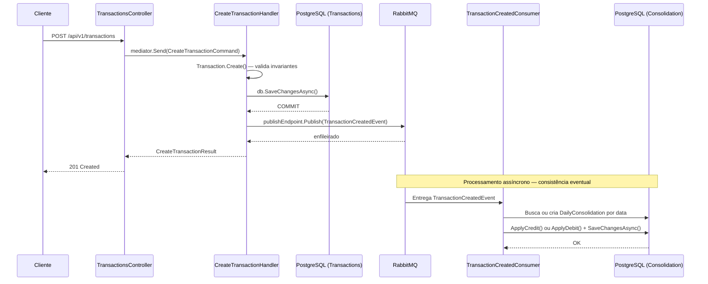

### 10.2 Fluxo de Consulta de Saldo (Cache Hit vs Miss)

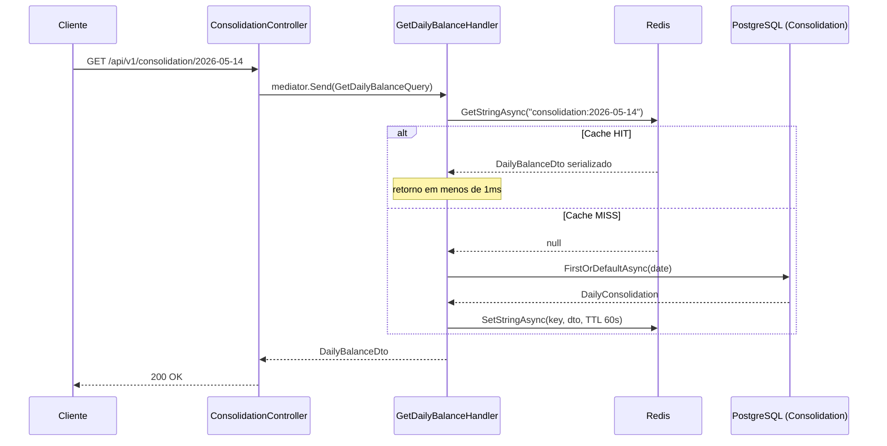

### 10.3 Configuração do RabbitMQ (MassTransit)

- **Exchange type:** Fan-out (MassTransit default)
- **Queue durável:** Sim (`durable: true`)
- **Retry policy:** 3 tentativas com backoff exponencial (5s, 15s, 45s)
- **Dead Letter Queue:** Criada automaticamente pelo MassTransit para mensagens não processadas
- **Prefetch count:** 16 (padrão MassTransit — permite paralelismo controlado)

---

## 11. Modelo de Dados

### 11.1 Schema: cashflow_transactions

```sql
CREATE TABLE "Transactions" (
    "Id"          UUID            NOT NULL PRIMARY KEY,
    "Amount"      NUMERIC(18, 2)  NOT NULL,
    "Type"        VARCHAR(10)     NOT NULL,  -- 'Debit' ou 'Credit'
    "Description" TEXT,
    "OccurredAt"  TIMESTAMPTZ     NOT NULL,
    "CreatedAt"   TIMESTAMPTZ     NOT NULL
);

CREATE INDEX "IX_Transactions_OccurredAt"
    ON "Transactions" ("OccurredAt");
```

**Justificativa do índice:** Consultas por data (`GET /transactions?date=`) filtram por `OccurredAt`. Sem índice, full table scan em volumes altos.

---

### 11.2 Schema: cashflow_consolidation

```sql
CREATE TABLE "DailyConsolidations" (
    "Id"               UUID            NOT NULL PRIMARY KEY,
    "Date"             DATE            NOT NULL,
    "TotalCredits"     NUMERIC(18, 2)  NOT NULL DEFAULT 0,
    "TotalDebits"      NUMERIC(18, 2)  NOT NULL DEFAULT 0,
    "TransactionCount" INTEGER         NOT NULL DEFAULT 0,
    "LastUpdatedAt"    TIMESTAMPTZ     NOT NULL
);

CREATE UNIQUE INDEX "IX_DailyConsolidations_Date"
    ON "DailyConsolidations" ("Date");
```

**Justificativa do índice único:** Garante que exista no máximo um consolidado por data. O índice único é um guard de integridade além da lógica de aplicação.

---

### 11.3 Estrutura do Cache Redis

| Chave | Valor | TTL |
|---|---|---|
| `consolidation:2026-05-14` | JSON serializado de `DailyBalanceDto` | 60 segundos |

**Consideração de TTL:** 60 segundos é um trade-off entre consistência (saldo pode estar até 1min desatualizado) e performance (elimina carga no PostgreSQL). Para o dia atual, pode-se considerar TTL menor (ex: 5s) em uma evolução futura.

---

## 12. Estratégia de Segurança

### 12.1 Controles Implementados (v1.1)

| Controle | Status | Descrição |
|---|---|---|
| **Autenticação JWT (Keycloak)** | Implementado | Todos os endpoints protegidos com Bearer JWT validado localmente via JWKS |
| **Autorização por Role** | Implementado | Roles granulares por operação: `transactions:write`, `transactions:read`, `consolidation:read` |
| HTTPS/TLS | Delegado ao infra | Terminação TLS no Load Balancer |
| Validação de input | Implementado | Validação em domínio + controller |
| SQL Injection | Mitigado | EF Core com consultas parametrizadas |
| Dados sensíveis | N/A | Não há PII nesta versão |

### 12.2 Modelo de Autenticação e Autorização

**Identity Provider:** Keycloak 26 (Realm: `cashflow`, Client: `cashflow-api`)

**Fluxo de autenticação:**

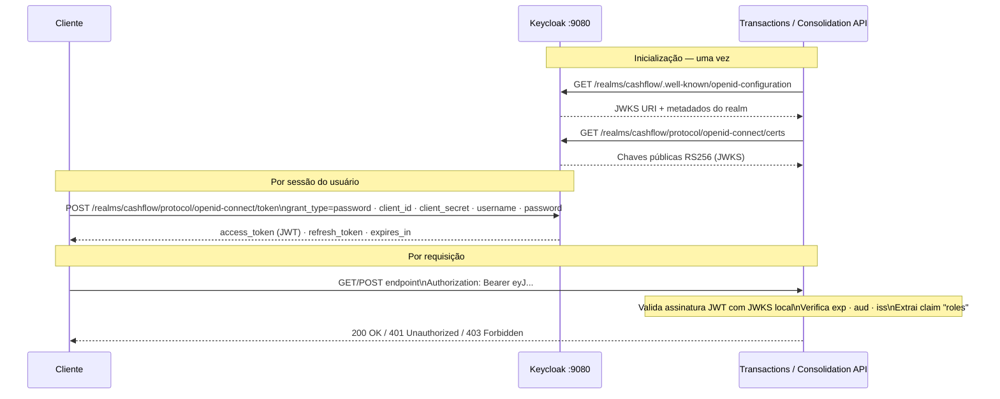

**Roles e endpoints protegidos:**

| Role | Serviço | Endpoint | Método |
|---|---|---|---|
| `transactions:write` | Transactions API | `/api/v1/transactions` | POST |
| `transactions:read` | Transactions API | `/api/v1/transactions` | GET |
| `consolidation:read` | Consolidation API | `/api/v1/consolidation/{date}` | GET |

**Usuários pré-configurados (desenvolvimento):**

| Usuário | Senha | Roles |
|---|---|---|
| `cashflow-admin` | `admin123` | `transactions:write`, `transactions:read`, `consolidation:read` |
| `cashflow-reader` | `reader123` | `transactions:read`, `consolidation:read` |

**Detalhes de configuração JWT:**
- Authority Docker: `http://keycloak:8080/realms/cashflow`
- Authority local: `http://localhost:9080/realms/cashflow`
- Audience: `cashflow-api`
- Algoritmo: RS256 (chaves gerenciadas pelo Keycloak)
- Claim de role: `roles` (mapeado via protocol mapper do Keycloak)
- Validação: assinatura + `exp` + `aud` + `iss` (sem round-trip ao IdP por request)

### 12.3 Controles Recomendados (roadmap)

**Credenciais do RabbitMQ por serviço:**
- Transactions: permissão apenas de publicação (`publish`)
- Consolidation: permissão apenas de consumo (`consume`)
- TLS no canal AMQP em produção

**Secrets Management:**
- Connection strings e client secret via AWS Secrets Manager ou Azure Key Vault
- Nunca em variáveis de ambiente em texto plano em produção

**Rate Limiting:**
- Proteção contra abuso na API de lançamentos
- Exemplo: 1000 req/min por IP; 100 req/min por token autenticado

**Auditoria:**
- Log de criações de lançamento com IP de origem e `sub` (usuário) do JWT
- Retenção de logs por 90 dias (mínimo)

---

## 13. Estratégia de Resiliência

### 13.1 Resiliência do Serviço de Lançamentos

O isolamento em relação ao serviço de Consolidação é garantido por design:

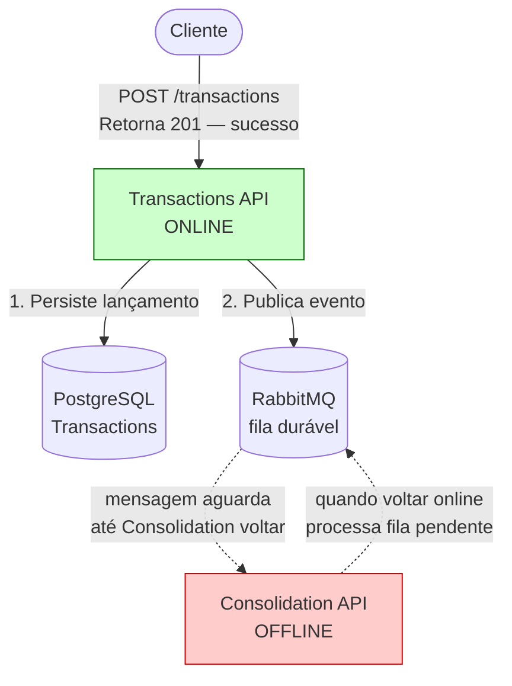

### 13.2 Retry Policy (MassTransit)

```
Tentativa 1 → aguarda 5s → Tentativa 2 → aguarda 15s → Tentativa 3 → aguarda 45s → DLQ
```

Mensagens que falham após 3 tentativas vão para a Dead Letter Queue para análise manual.

### 13.3 Resiliência do Consolidation em Picos

```
50 RPS chegando em GET /consolidation/{date}
│
├─ ~95% das requisições: CACHE HIT no Redis (< 1ms)
│   └── Redis suporta > 100.000 RPS por instância
│
└─ ~5% das requisições: CACHE MISS → PostgreSQL
    └── PostgreSQL com índice único por Date: < 10ms
```

**Resultado:** Nenhuma requisição é perdida em condições normais de pico. O Redis absorve a carga.

### 13.4 Health Checks

Ambos os serviços expõem `GET /health` que verifica:

| Serviço | Checks |
|---|---|
| Transactions API | PostgreSQL (transactions), RabbitMQ |
| Consolidation API | PostgreSQL (consolidation), Redis |

### 13.5 Tratamento de Erros da Aplicação

#### Global Exception Handler

Ambos os serviços possuem um middleware de tratamento global de exceções registrado como **primeiro middleware no pipeline** (antes do Swagger e autenticação). Garante que qualquer exceção não tratada resulte em:

- Resposta JSON estruturada com `error` e `traceId` (jamais stack trace exposto ao cliente)
- Log de `Error` com o `TraceId`, método HTTP e path — rastreável no sistema de logs
- HTTP 500 com `Content-Type: application/json`

```json
{
  "error": "An unexpected error occurred.",
  "traceId": "00-4bf92f3577b34da6a3ce929d0e0e4736-00f067aa0ba902b7-01"
}
```

#### Resiliência do Cache Redis (Consolidation)

A leitura e escrita no Redis estão isoladas em métodos com try-catch. Redis fora do ar não derruba o endpoint de consulta:

| Cenário | Comportamento | Log |
|---|---|---|
| Redis indisponível na leitura | Fallback transparente para PostgreSQL | `Warning` com exceção |
| Redis indisponível na escrita | Resultado retornado sem cachear | `Warning` com exceção |
| Redis disponível | Fluxo normal de cache-aside | `Debug` (hit ou miss) |

#### Validação no Consumer (Dead Letter Queue)

O `TransactionCreatedConsumer` valida explicitamente o tipo do evento antes de processar. Um evento com tipo desconhecido:
1. Loga `Error` com o `TransactionId` e tipo inválido
2. Lança `ArgumentException`, ativando o retry policy do MassTransit
3. Após esgotar as tentativas (3x), a mensagem é movida para a DLQ automaticamente

Isso evita que uma mensagem malformada entre em loop infinito silencioso ou atualize dados incorretamente.

#### Validação de Domínio (DailyConsolidation)

`ApplyCredit` e `ApplyDebit` rejeitam valores `<= 0` com `ArgumentException`. A validação no domínio garante que regras de negócio críticas sejam aplicadas independentemente de qual camada invocou o método.

---

## 14. Observabilidade e Monitoramento

### 14.1 Logging Estruturado

Framework: `ILogger<T>` nativo do ASP.NET Core com saída JSON em produção.

**Eventos de negócio logados:**

| Evento | Nível | Serviço | Campos |
|---|---|---|---|
| Lançamento persistido no banco | `Information` | Transactions | TransactionId, Amount, Type, OccurredAt |
| Evento consumido pelo consolidation | `Information` | Consolidation | TransactionId, Type, Amount, Date |
| Consolidação atualizada | `Information` | Consolidation | Date, Balance, TransactionCount |
| Cache hit | `Debug` | Consolidation | CacheKey |
| Cache miss | `Debug` | Consolidation | CacheKey |
| Erro de validação de request | `Warning` | Transactions | Mensagem de erro, Amount, Type |
| Falha ao publicar evento no RabbitMQ | `Error` | Transactions | TransactionId, Exceção |
| Tipo de evento desconhecido no consumer | `Error` | Consolidation | TransactionId, Type (vai para DLQ) |
| Falha de leitura no Redis | `Warning` | Consolidation | CacheKey, Exceção |
| Falha de escrita no Redis | `Warning` | Consolidation | CacheKey, Exceção |
| Exceção não tratada (global handler) | `Error` | Ambos | Method, Path, TraceId, Exceção |

### 14.2 Métricas (Roadmap — OpenTelemetry)

```
Métricas recomendadas:
│
├── cashflow_transactions_created_total        (counter)
├── cashflow_transactions_created_amount_sum   (counter - valor acumulado)
├── cashflow_http_request_duration_seconds     (histogram - p50, p95, p99)
├── cashflow_consolidation_cache_hit_total     (counter)
├── cashflow_consolidation_cache_miss_total    (counter)
└── cashflow_rabbitmq_messages_processed_total (counter)
```

### 14.3 Alertas Recomendados

| Alerta | Condição | Severidade |
|---|---|---|
| Health check falhou | `/health` retorna não-Healthy por > 30s | Critical |
| Taxa de erro alta | `5xx / total > 1%` em 5 minutos | High |
| Latência elevada | `p95 > 500ms` em Transactions por 5 min | Medium |
| Cache hit rate baixo | `hit_rate < 80%` no Consolidation | Low |
| DLQ com mensagens | DLQ com > 0 mensagens por > 1 hora | High |

### 14.4 Tracing Distribuído (Roadmap)

Com OpenTelemetry, cada requisição geraria um `TraceId` propagado através de:
1. Header HTTP `traceparent`
2. Header AMQP no corpo da mensagem RabbitMQ

Permitiria visualizar o path completo: `POST /transactions → RabbitMQ → Consumer → PostgreSQL` em ferramentas como Jaeger ou AWS X-Ray.

---

## 15. Arquitetura de Deploy

### 15.1 Docker Compose (Desenvolvimento Local)

```yaml
Serviços:
├── keycloak           → :9080  (Admin UI: /admin · Token: /realms/cashflow/protocol/openid-connect/token)
├── transactions-api   → :8080
├── consolidation-api  → :8081
├── postgres-tx        → :5432
├── postgres-cons      → :5433
├── rabbitmq           → :5672 (AMQP), :15672 (Management)
└── redis              → :6379
```

**Auto-provisioning:** Migrations aplicadas automaticamente no startup (`db.Database.Migrate()`).

> **API Gateway em desenvolvimento:** o AWS API Gateway não existe no ambiente local. Os serviços são acessados diretamente em `:8080` (Transactions) e `:8081` (Consolidation). A validação de JWT pelo Keycloak continua funcionando via JwtBearer em cada serviço.

### 15.2 Arquitetura AWS (Produção)

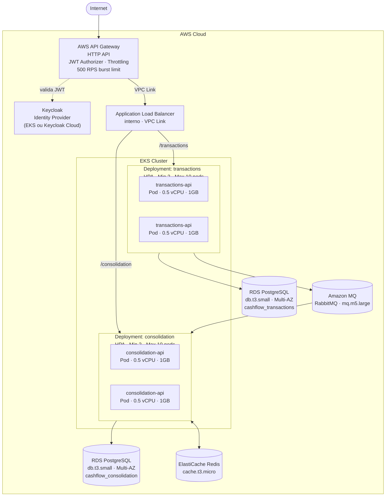

---

## 16. Architecture Decision Records (ADRs)

### ADR-001: Microsserviços em vez de Monolito

**Contexto:** O requisito NFR-01 exige que o serviço de lançamentos permaneça operacional mesmo quando o consolidado falha.

**Decisão:** Dois microsserviços independentes com deploys separados.

**Consequências:**
- (+) Isolamento de falhas — falha no Consolidation não afeta Transactions
- (+) Escalabilidade independente — cada serviço escala conforme sua carga
- (+) Deploy independente — atualizações sem downtime do outro serviço
- (-) Complexidade operacional maior (2 apps, 2 bancos, mensageria)
- (-) Consistência eventual (trade-off aceito pelo negócio)

---

### ADR-002: RabbitMQ como Message Broker

**Contexto:** Precisamos de comunicação assíncrona entre os serviços.

**Decisão:** RabbitMQ via MassTransit.

**Alternativas consideradas:**

| Opção | Prós | Contras |
|---|---|---|
| **RabbitMQ + MassTransit** | Maturidade, retry built-in, DLQ automática | Não é Kafka (sem replay de histórico) |
| Apache Kafka | Replay de eventos, log imutável | Over-engineering para volume atual |
| AWS SQS | Serverless, gerenciado | Vendor lock-in; polling model |

**Justificativa:** RabbitMQ é suficiente para o volume (50 RPS) e MassTransit abstrai retry, DLQ e serialização. Kafka seria over-engineering aqui.

---

### ADR-003: CQRS com MediatR

**Contexto:** Commands (escrita) e Queries (leitura) têm características e otimizações distintas.

**Decisão:** MediatR para separação de Commands e Queries dentro de cada serviço.

**Consequências:**
- (+) Cada handler tem responsabilidade única e é testável isoladamente
- (+) Facilita evolução: otimizar leitura (ex: read replica) sem afetar escrita
- (+) Desacopla controller da lógica de negócio
- (-) Mais classes/arquivos que uma abordagem direta

---

### ADR-004: Cache-Aside com Redis (TTL 60s)

**Contexto:** Consolidation precisa suportar 50 RPS com ≤ 5% de perda sem sobrecarregar o PostgreSQL.

**Decisão:** Cache-aside com Redis e TTL de 60 segundos.

**Cálculo:** Com 50 RPS e TTL 60s, o PostgreSQL recebe no máximo 1 query a cada 60s por data consultada (cache miss) mais um volume mínimo de cache misses aleatórios. Isso é praticamente zero carga comparado a 50 RPS direto no banco.

**Trade-off de TTL:** 60 segundos = saldo pode estar até 1 minuto desatualizado. Aceitável para relatório de saldo diário consolidado (não é dado em tempo real crítico).

---

### ADR-005: Database per Service

**Contexto:** Isolamento de dados entre os microsserviços.

**Decisão:** Dois bancos PostgreSQL separados — um por serviço.

**Consequências:**
- (+) Falha em um banco não derruba o outro serviço
- (+) Schema pode evoluir independentemente
- (+) Cada banco pode usar tecnologia diferente no futuro
- (-) Não há joins cross-service (resolvido via eventos)
- (-) Custo de dois bancos vs um

---

### ADR-007: Keycloak como Identity Provider

**Contexto:** Os endpoints das APIs precisam de autenticação e autorização com controle granular por operação. A solução deve ser portável, baseada em padrões abertos e versionável como código.

**Decisão:** Keycloak 26 como Identity Provider com autenticação JWT Bearer em cada serviço e realm exportável em JSON.

**Alternativas consideradas:**

| Opção | Prós | Contras |
|---|---|---|
| **Keycloak (escolhido)** | Open source; OIDC/OAuth2 padrão; realm como código; fácil de dockerizar | Maior consumo de memória (~512MB) |
| ASP.NET Core Identity | Nativo; sem infra adicional | Não é federado; dificulta SSO e multitenancy |
| AWS Cognito | Gerenciado; sem infra | Vendor lock-in; custo por MAU em produção |
| Auth0 | Gerenciado; fácil integração | Vendor lock-in; custo por MAU |

**Consequências:**
- (+) Padrão OAuth2/OIDC — compatível com qualquer cliente (browser, mobile, M2M)
- (+) Roles e scopes configuráveis por realm sem alterar código de aplicação
- (+) Tokens JWT validados localmente (sem round-trip ao IdP por request)
- (+) Realm exportado em JSON — configuração versionada como código (`keycloak/cashflow-realm.json`)
- (+) Realm importado automaticamente no startup do container via `--import-realm`
- (-) Serviço adicional no docker-compose (~512MB RAM)
- (-) Tempo de startup maior (~60–90s em desenvolvimento)

---

### ADR-008: AWS API Gateway HTTP API como ponto de entrada

**Contexto:** Com dois microsserviços expostos, é necessário um ponto de entrada único que centralize roteamento, throttling e validação de JWT — sem replicar essa lógica em cada serviço individualmente.

**Decisão:** AWS API Gateway HTTP API com JWT Authorizer apontando para o Keycloak, integração privada via VPC Link com o ALB interno do EKS.

**Alternativas consideradas:**

| Opção | Prós | Contras |
|---|---|---|
| **AWS API Gateway HTTP API (escolhido)** | Gerenciado; zero infra; JWT Authorizer nativo; throttling built-in | Vendor lock-in; não roda em dev; latência adicional ~5ms |
| Traefik | Funciona em dev e prod; discovery automático | Infra adicional para gerenciar em prod |
| Kong | Rico em plugins; admin API | Mais complexo; requer banco próprio |
| NGINX Ingress | Simples; padrão K8s | Sem admin API; recursos de API management limitados |

**Consequências:**
- (+) Ponto de entrada único — clientes não conhecem endereços internos dos serviços
- (+) JWT Authorizer centraliza validação de token antes de chegar nas APIs (primeira camada de defesa)
- (+) Throttling e burst limit configuráveis por rota sem alterar código
- (+) Zero infra para gerenciar em produção
- (+) Custo por uso — ~$1/milhão de requests (baixo custo para volumes pequenos)
- (-) Não existe em desenvolvimento local; ambiente assimétrico entre dev e prod
- (-) Latência adicional de ~5ms por request
- (-) Vendor lock-in AWS

**Nota sobre dupla validação de JWT:** o API Gateway valida o token na borda (latência mínima, rejeição rápida). Os serviços também validam localmente via JwtBearer — defesa em profundidade; nenhuma configuração precisa ser removida.

---

### ADR-006: Consistência Eventual como Modelo de Consistência

**Contexto:** Com comunicação assíncrona, o consolidado pode ficar alguns segundos atrás dos lançamentos.

**Decisão:** Aceitar consistência eventual entre Transactions e Consolidation.

**Justificativa:** O requisito de negócio é "relatório de saldo diário consolidado" — não "saldo em tempo real". Um delay de segundos é imperceptível e aceitável para o comerciante. Alternativas como Saga 2-phase commit adicionariam complexidade desproporcional ao benefício.

---

## 17. Arquitetura de Transição

### 17.1 Cenário de Migração de Legado

Assumindo que a organização possui um sistema legado monolítico (ex: planilha Excel, sistema desktop, ERP antigo) e precisa migrar para esta solução:

### 17.2 Fases de Transição

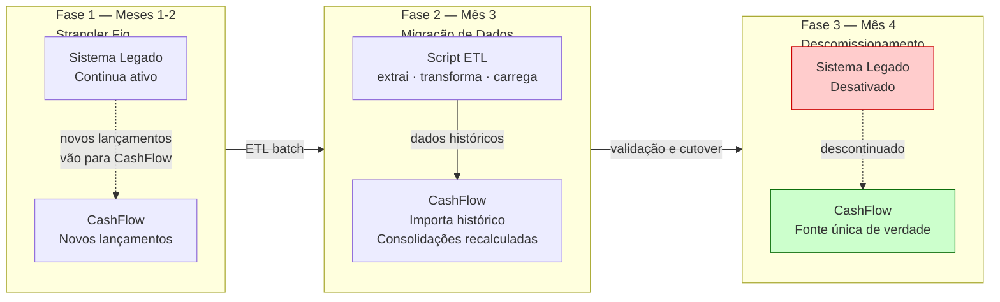

### 17.3 Estratégia de Migração de Dados

**Para cada lançamento histórico no legado:**

```json
POST /api/v1/transactions
{
  "amount": 500.00,
  "type": "credit",
  "description": "[MIGRADO] Venda 01/01/2024",
  "occurredAt": "2024-01-01T00:00:00Z"
}
```

O campo `occurredAt` permite importar datas históricas preservando a linha do tempo real. O consolidado é recalculado automaticamente via eventos.

---

## 18. Estimativa de Custos

### 18.1 Ambiente de Produção — AWS (Pequeno Porte)

| Componente | Serviço AWS | Configuração | Custo/mês (USD) |
|---|---|---|---|
| API Gateway | AWS API Gateway HTTP API | ~1M req/mês + VPC Link | ~$8 |
| EKS Control Plane | EKS | 1 cluster | ~$73 |
| EC2 Worker Nodes | EC2 t3.small | 2 nodes | ~$30 |
| PostgreSQL Transactions | RDS db.t3.micro Multi-AZ | 20GB SSD | ~$30 |
| PostgreSQL Consolidation | RDS db.t3.micro Multi-AZ | 20GB SSD | ~$30 |
| RabbitMQ | Amazon MQ mq.m5.large | Single-instance | ~$100 |
| Redis | ElastiCache cache.t3.micro | Single-node | ~$15 |
| Load Balancer | ALB (interno) | Por hora + LCUs | ~$20 |
| Transferência de dados | — | Estimativa baixo uso | ~$5 |
| **Total estimado** | | | **~$311/mês** |

### 18.2 Otimizações de Custo Possíveis

| Otimização | Economia Estimada | Trade-off |
|---|---|---|
| RDS Single-AZ (não Multi-AZ) | -$15/banco | Menor disponibilidade em falha de AZ |
| Amazon MQ broker.mq.t3.micro | -$80 | Limite de conexões; não recomendado para prod |
| EC2 Spot Instances (nodes) | -60% nos nodes | Pods podem ser interrompidos; usar PodDisruptionBudget |
| ElastiCache Serverless | Variável | Pay-per-use; pode ser mais caro em pico |

### 18.3 Custo para Escala (Médio Porte — 500 RPS)

| Componente | Ajuste | Custo adicional |
|---|---|---|
| EC2 Worker Nodes | 2 nodes adicionais (t3.small) | +$30/mês |
| RDS | db.t3.small Multi-AZ | +$20/banco |
| ElastiCache | cache.t3.small | +$20 |
| Amazon MQ | cluster (3 brokers) | +$200 |
| **Total estimado 500 RPS** | | **~$600/mês** |

---

## 19. Melhorias Futuras e Roadmap

### 19.1 Curto Prazo (1-3 meses)

| Melhoria | Impacto | Complexidade |
|---|---|---|
| **Idempotência no Consumer** | Evita duplicatas em caso de redelivery do RabbitMQ | Baixa |
| **Outbox Pattern** | Garante atomicidade entre persistência no DB e publish no RabbitMQ | Média |
| **Invalidação de cache no Consumer** | Saldo do dia atual atualizado em segundos, não 1 minuto | Baixa |

**Detalhe — Idempotência:** Adicionar tabela `ProcessedEvents` com `TransactionId` (unique) no banco do Consolidation. Antes de processar, verificar se já foi processado.

**Detalhe — Outbox Pattern:**
```
ATUAL:  db.SaveChanges() + publishEndpoint.Publish()  ← não atômico
FUTURO: db.SaveChanges() inclui OutboxMessage         ← atômico
        Background worker processa OutboxMessage e publica
```

### 19.2 Médio Prazo (3-6 meses)

| Melhoria | Impacto | Complexidade |
|---|---|---|
| **OpenTelemetry** | Observabilidade end-to-end (traces, métricas) | Média |
| **Read Replicas no PostgreSQL** | Separa carga de leitura e escrita | Alta |
| **Rate Limiting** | Proteção contra abuso | Baixa |
| **Paginação na listagem** | Performance em grandes volumes | Baixa |
| **Categorias de lançamento** | Análise por tipo (vendas, despesas, etc.) | Média |

### 19.3 Longo Prazo (6-12 meses)

| Melhoria | Impacto | Complexidade |
|---|---|---|
| **Relatórios avançados** | Exportação PDF/CSV, gráficos, análise de tendências | Alta |
| **Multi-tenant** | Suporte a múltiplos comerciantes com isolamento de dados | Alta |
| **Integração bancária** | Conciliação automática via Open Finance | Alta |
| **Event Sourcing** | Histórico completo de mudanças no consolidado | Alta |
| **Mobile App** | Interface nativa para iOS/Android | Alta |

---

## 20. Glossário

| Termo | Definição |
|---|---|
| **Lançamento** | Registro de um evento financeiro (entrada ou saída) |
| **Débito** | Saída de dinheiro (pagamento, despesa) |
| **Crédito** | Entrada de dinheiro (venda, recebimento) |
| **Saldo** | Diferença entre total de créditos e total de débitos em um período |
| **Consolidado Diário** | Resumo agregado de todos os lançamentos de um dia |
| **Microsserviço** | Serviço independente com responsabilidade única e deploy próprio |
| **Event-Driven** | Arquitetura onde serviços comunicam via eventos assíncronos |
| **CQRS** | Padrão de separação entre operações de escrita (Command) e leitura (Query) |
| **Cache-Aside** | Padrão onde a aplicação gerencia manualmente o cache (read-through manual) |
| **Consistência Eventual** | Modelo onde o sistema converge para um estado consistente após um delay aceitável |
| **Dead Letter Queue** | Fila para mensagens que falharam após todas as tentativas de retry |
| **Bounded Context** | Limite explícito dentro do qual um modelo de domínio é definido e aplicável |
| **Idempotência** | Propriedade de uma operação que pode ser executada múltiplas vezes com o mesmo resultado |
| **Outbox Pattern** | Padrão que garante atomicidade entre persistência em banco e publicação de evento |
